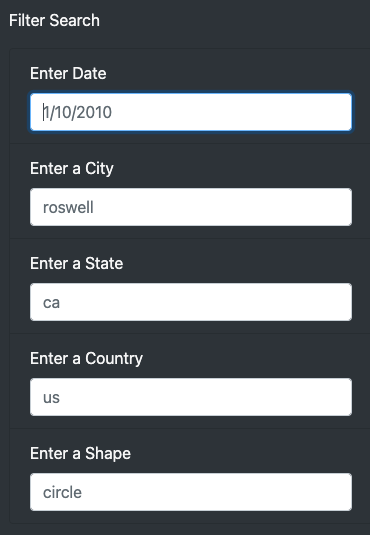
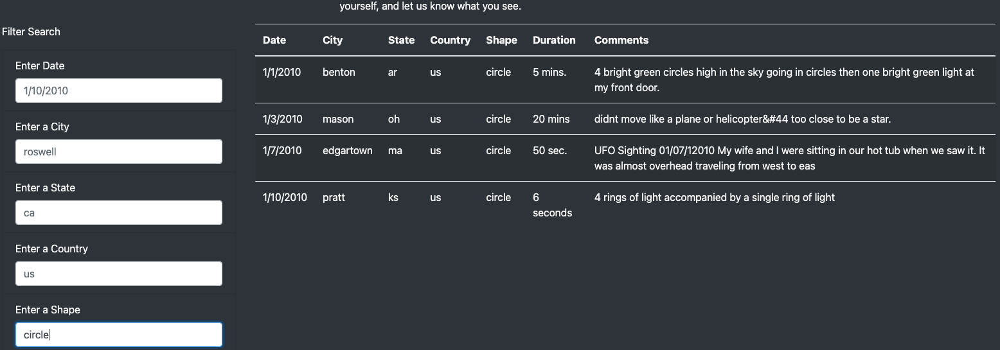

# UFOs

## Overview of Project

The purpose of this analysis was to create a dynamic webpage for our client Dana to receive user inputs for date, city, state, country, and shape to filter a table of UFO sightings data. The filter system will use an event listener to automatically know when data has been inputed. Multiple criteria can be entered concurrently to create more filtered results.

## Results

The site is set up to filter the table's data based on the search criteria for date, city, state, country, and shape. The user should type the specific search criteria into the appropriate text box and press enter or click on a different text box. These textboxes are shown in the image above. Because there is an event listener set up, the table will automatically filter to the criteria without the need of a dedicated button. The user is also able to input multiple criteria at once.

The example above shows the results for when the user typed in "circle" into the "Enter a Shape" textbox. The table results automatically changed after enter was pressed once "circle" was typed.

## Summary

One drawback of this new design is that there is no indication the results have been updated other than the table changing. So if you hypothetically were viewing an empty table using inputs that were not a match, then you entered a different input that also wasn't a match, nothing would happen. It could lead the user to believe that the system wasn't working. 

I recommend adding a label "Table Updated" that pops up underneath the search criteria text boxes whenever the table is updated. This would solve the issue stated above and lead to a better user experience.

Another issue with the current design is that the size of the table dictates how long the web page is. Since the table is constantly changing, the web page length also changes with it which is somewhat sloppy. I recommend encapsulating the table in a scrollable section. That way the table is always the same size on the web page with the ability to scroll through the results. This way the length of the entire web page would not change.